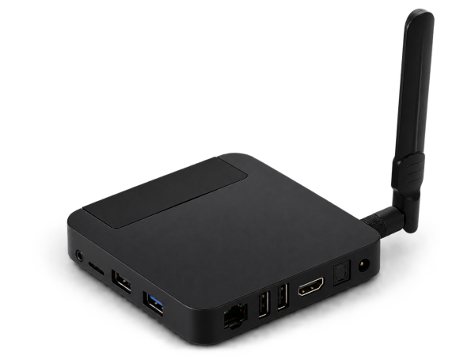

<p align="center"></p>

# Ugoos UT3s

Rockchip **RK3288** (quad Cortex-A17, 32-bit ARMv7) TV-box with 2 GiB RAM,
booted from eMMC or SD via the vendor U-Boot.

**Vendor:** [ugoos.com/ugoos-ut3s-16gb](https://www.ugoos.com/ugoos-ut3s-16gb)

## Status

### Working

- **Storage** — eMMC / SD card / SDIO (DesignWare MMC).
- **Ethernet** — GMAC + Realtek RTL8211E.
- **USB 2.0** — OTG + host ports (`dwc2` + EHCI/OHCI).
- **Display** — HDMI via `rockchip-drm` + `dwhdmi-rockchip` (VOP0/VOP1).
- **HDMI audio** — I2S0 → dw-hdmi (`simple-audio-card`).
- **GPU** — Mali-T760 MP4 via Panfrost + glamor (modesetting).
- **Wi-Fi** — Broadcom BCM4339 (AP6335) via `brcmfmac`.
- **Bluetooth** — BCM4339 over UART0 + userspace `brcm_patchram_plus`.
- **PMIC / thermal / RTC** — ACT8846 + SYR827/828 regulators, TSADC, HYM8563.
- **Board glue** — power LED, cooling fan, gpio-keys.
- **CPU serial & Ethernet MAC** — SoC serial number and the vendor MAC address.

### Not working

- **Hardware video codecs** — H.265 decode and H.264 encode have no mainline driver.
- **Analog audio / S/PDIF** — no upstream driver for RK1000 codec, S/PDIF isn't wired.
- **IR receiver and transmitter** — no upstream driver.
- **Watchdog** — deliberately disabled.
- **Camera / eDP / LVDS / MIPI DSI** — not fitted on this board.

## Userspace requirements

Some hardware needs userspace components (firmware or helper binaries) on top of
the kernel driver.

### Wi-Fi

Install the package `firmware-brcm80211` (Debian), then place the vendor NVRAM file
at `/lib/firmware/brcm/brcmfmac4339-sdio.txt`:

### Bluetooth

Two files extracted from the stock Xubuntu 0.3.1 SD-card image are required:

- `bcm4339a0.hcd` — Bluetooth firmware (HCD patchram), installed to `/lib/firmware/brcm/`.
- `brcm_patchram_plus` — the HCI bring-up helper binary, installed to `/usr/local/sbin/`.

An init script is also needed to assert the power GPIOs and keep `brcm_patchram_plus` running.
Installation and start-up scripts are still under development and will be published later.

## Building

Target config is `ut3s_defconfig`.

```sh
# GCC (requires an arm-linux-gnueabihf cross-toolchain)
make ARCH=arm CROSS_COMPILE=arm-linux-gnueabihf- O=out ut3s_defconfig
make ARCH=arm CROSS_COMPILE=arm-linux-gnueabihf- O=out -j"$(nproc)"

# LLVM 21 (clang + lld; no ARM binutils needed)
make ARCH=arm LLVM=-21 O=out ut3s_defconfig
make ARCH=arm LLVM=-21 O=out -j"$(nproc)"
```

Artifacts land in `out/arch/arm/boot/` (`zImage` and `dts/rockchip/rk3288-ut3s.dtb`).

To update the kernel and DTB inside a Rockchip firmware image, use
[imgRePackerRK](https://xdaforums.com/t/tool-imgrepackerrk-rockchips-firmware-images-unpacker-packer.2257331/).
