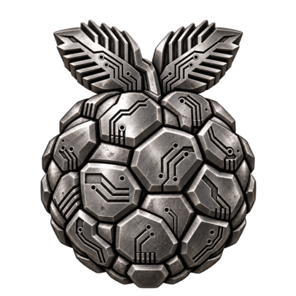

# Hallon kernel

A long-term-supported Linux kernel for devices that are no longer officially
maintained by their vendors.

## What this project is for

- **Porting** the current LTS Linux kernel to officially unsupported devices.
- **Backporting** new features from newer kernels.
- **Implementing** new features.

## Supported devices

- **Ugoos UT3s** TV-box.

## Configuration

`x86_64` build is optimized for `x86-64-v2` by default.
Added `x86_64_hallon_defconfig` based on the stock Debian kernel configuration.

A `HALLON_BACKPORTS` Kconfig option is provided to enable drivers and features backported from newer kernels.

### Backports currently available

- **Realtek 8852CU** Wi-Fi driver.
